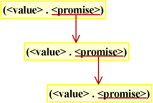

# 惰性求值

## 简介

惰性求值（Lazy evaluation）是在需要时才进行求值的计算方式。惰性求值自然地在数据结构中包含递归，可以以简单的方式表示无限的概念，这种方式有利于程序的模块化。

你可以在[《Why Functional Programming Matters》](www.md.chalmers.se/~rjmh/Papers/whyfp.html)中获知惰性求值可以带来哪些好处。

[Haskell](www.haskell.org/)语言以完全采用惰性求值而广为人知。Scheme也采用了惰性求值（即使是部分采用）。

## 用于惰性求值的函数

下面这些用于处理惰性求值的函数是在R5RS中定义的。中间状态被称为延时对象（`promise`），它表示求值方法已经定义好了，但求值还未执行。最终的值通过对promise调用force被计算出来。

**(delay `proc`)**

以proc创建一个延时对象（`promise`）。

**(promise? `obj`)**

如果`obj`是一个延时对象就返回 #t。

**(force `promise`)**

对延时对象求值，执行求值操作。

## 惰性求值的简单例子

[例1]展示一个惰性求值的简单例子。在这个例子中，延时对象（`promise`）通过对(1 + 2)调用`delay`产生，然后通过函数`force`对延时对象求值。

[例1]

```scheme
(define laz (delay (+ 1 2)))
;Value: laz

laz
;Value 11: #[promise 11]

(promise? laz)
;Value: #t

(force laz)
;Value: 3

(* 10 (force laz))
;Value: 30

```

注意延时对象并没有被force消费掉，这意味着函数force没有副作用。因此，你可以重复使用延时对象。

## 使用惰性求值表示无限序列

现在，让我们使用惰性求值创建无限序列。首先，我将定义一些用于处理无限序列的基本函数。然后，我会使用这些函数创建无限序列，并将无限序列用于数值计算。

无限序列可以用如表达式（1）的cons单元的嵌套结构表示。cons单元的car和cdr分别是最终值和延时对象（promise）。另一个表达式（1）结构的cons单元通过强制求值cdr部分产生，你可以无限重复这个过程，就像图.1。这个个cons单元的嵌套结构和普通表类似，只是使用延时对象作为cdr部分使其可以表示无限序列。

```
	(<val> . <promise>)    (1)
```



图 1. 无限序列的实现，使用了car和cdr分别为最终值和延时对象的cons单元。

### 无限序列的基本函数和宏

[代码 1]展示了无限序列的基本函数和宏。其中最重要的是`lazy-map`，被用于操作无限序列。

由于`lazy-map`包含一个特殊delay构造用于延迟求值，所以它需要被定义为宏。

[代码 1]

```scheme
01:     ;;;;; basic functions and a macro
02:     
03:     ;;; car for lazy evaluation
04:     (define lazy-car car)
05:     
06:     ;;; cdr for lazy evaluation
07:     (define (lazy-cdr ls)
08:       (force (cdr ls)))
09:     
10:     ;;; lazy cons
11:     (define-syntax lazy-cons
12:        (syntax-rules ()
13:           ((_ a b) (cons a (delay b)))))
14:     
15:     ;;; lazy map
16:     (define (lazy-map fn . lss)
17:       (if (memq '() lss)
18:           '()
19:         (lazy-cons (apply fn (map lazy-car lss))
20:                    (apply lazy-map fn (map lazy-cdr lss)))))
21:     
22:     ;;; lazy filter
23:     (define (lazy-filter pred ls)
24:       (if (null? ls)
25:           '()
26:         (let ((obj (lazy-car ls)))
27:           (if (pred obj)
28:               (lazy-cons obj  (lazy-filter pred (lazy-cdr ls)))
29:             (lazy-filter pred (lazy-cdr ls))))))
30:     
31:     ;;; returns n-th item of the lazy list
32:     (define (lazy-ref ls n)
33:       (if (= n 0)
34:           (lazy-car ls)
35:         (lazy-ref (lazy-cdr ls) (- n 1))))
36:     
37:     ;;; returns first n items of the ls
38:     (define (head ls n)
39:       (if (= n 0)
40:           '()
41:          (cons (lazy-car ls) (head (lazy-cdr ls) (- n 1)))))
```

**(lazy-car ls)**

和(car ls)一样，因为car部分是最终值。

**(lazy-cdr ls)**

计算`ls`的cdr部分（延时对象）的‘最终’值。

**(lazy-cons a b)**

这是一个扩展了(cons a (delay b))的宏。如果这个操作被定义为一个函数，`b`将立刻求值，这样delay就没有任何意义了。

**(lazy-map fn . lss)**

这是一个惰性求值的map函数，是在[代码 1]中最重要的函数。注意它返回一个包含最终值（car部分）和延时对象（cdr部分）的cons单元。

**(lazy-filter pred ls)**

这是一个惰性求值的filter函数。它过滤`ls`并返回一个由包含满足`pred`条件的元素组成的‘无限序列’。

**(lazy-ref ls n)**

返回'无限序列'`ls`的第n个元素。

**(head ls n)**

返回`ls`（惰性求值表）的前n个元素。

### 无限序列

无限系列可以简洁地使用哪个lazy-cons和lazy-map表示。我会展示两个例子：

- 下一项由前一项定义的序列，如等差数列和等比数列
- 菲波那契数列

#### 下一个项由前一项定义的序列

下一个项由前一项定义的序列可以有如下形式的函数（f）定义：

\\[{a}\_{i+1} = f(\{a}\_i) \\]

可以表示为[代码2]里的`(inf-seq a0 f)`，`a0`和`f`分别是除始项和用于计算随后项的函数。

`(inf-seq a0 f)`是递归定义的，它的定义清晰表明初始项是a0，第二项是(f a0)，（n+1）项由(f an)表示。

等差和等比数列分别被定义为`(ari a0 d)`和`(geo a0 r)`，其中`a0`，`d`和`r`分别是初始值，公差，公比。这些函数使用函数inf-seq定义。

[代码2]

```scheme
01:     ;;;;  sequences
02:     
03:     ;;; infinite sequences represented by a_(n+1) = f(a_n)
04:     (define (inf-seq a0 f)
05:       (lazy-cons a0 (inf-seq (f a0) f)))
06:     
07:     ;;; arithmetic sequence
08:     (define (ari a0 d)
09:       (inf-seq a0 (lambda (x) (+ x d))))
10:     
11:     ;;; geometric sequence
12:     (define (geo a0 r)
13:       (inf-seq a0 (lambda (x) (* x r))))
```

让我们建议一下inf-seq产生的无限序列（例2）。创建两个等比数列：

1. `g1`，初始值1，公比为2。
2. `g2`，初始值1，公比为1/2。

然后使用head求值前10项。你将看到正确产生了两个等比数列。

接下来，使用lazy-map计算g1和g2的乘积，并使用head求值前10项。你将看到一个全是1的序列，这表明计算被正确地执行了。

现在，让我们用等差数列和lazy-filter做一些游戏。首先，用 (ari 1 1)创建一个等比数列`ar1`。(head ar1 10) 的结果显示等比数列 (1 2 3 ....) 是由 (ari 1 1)产生的。然后使用lazy-filter取出`ar1`里的偶数，并使用head求值前10项。你将看到 (2 4 6 8 10 12 14 16 18 20)，这表明lazy-filter正常工作。

[例2]

```scheme
(define g1 (geo 1 2))
;Value: g1

(define g2 (geo 1 (/ 1 2)))
;Value: g2

(head g1 10)
;Value 12: (1 2 4 8 16 32 64 128 256 512)

(head g2 10)
;Value 13: (1 1/2 1/4 1/8 1/16 1/32 1/64 1/128 1/256 1/512)

(head (lazy-map * g1 g2) 10)
;Value 14: (1 1 1 1 1 1 1 1 1 1)

(define ar1 (ari 1 1))
;;Value: ar1

(head ar1 10)
;;Value 15: (1 2 3 4 5 6 7 8 9 10)

(head (lazy-filter even? ar1) 10)
;;Value 16: (2 4 6 8 10 12 14 16 18 20)

```

#### 菲波那切数列

菲波那切数列定义如下：

```
fib(1) = 1
fib(2) = 1
fib(n+1) = fib(n) + fib(n-1)
```

代码3展示了Scheme实现的菲波那切数列，用到了lazy-cons和lazy-map。如代码所示，Scheme里的定义和数学上的定义很相似。此外，各项的计算的复杂度为*O(n)*。

[例3]中的值被立刻计算出来了。

[代码 3]

```scheme
01:     (define fib
02:       (lazy-cons 1
03:                  (lazy-cons 1
04:                             (lazy-map + fib (lazy-cdr fib)))))
```

[例 3]

```scheme
(head fib 20)
;Value 12: (1 1 2 3 5 8 13 21 34 55 89 144 233 377 610 987 1597 2584 4181 6765)

(lazy-ref fib 100)
;Value: 573147844013817084101
```


### 将惰性求值用于数值计算

下面是[《Why Functional Programming Matters》](www.md.chalmers.se/~rjmh/Papers/whyfp.html)里代码的Schme版本。也可以查看[SICP 3.5. Stream](http://mitpress.mit.edu/sicp/full-text/book/book-Z-H-24.html#%_sec_3.5)惰性计算在数值计算中的应用。

#### 牛顿-拉夫逊法求平方根

牛顿-拉夫逊法可以使用初始值a0和等式（2）计算N的平方根。

```
     a(n+1) =  (a(n) + N/a(n)) / 2                   (2)
```

如果等式（2）收敛到最终值 a，

```
      a =  (a +  N/a) / 2
⇒
      2a = a +  N/a
      a =  N/a
      a*a = N
      a =  √N
```

，这表明最终值a是N的平方根。序列的下一项是前一项的函数（如等式（2）展示的），这些序列用inf-seq表示。

代码4展示了一个计算平方根的程序。在代码4中，初始值被定为1，由于序列收敛很快所以这没问题的。

[代码4]

```scheme
01:     ;;; Newton-Raphson method
02:     (define (newton-raphson n)
03:       (inf-seq 1 (lambda (x) (/ (+ x (/ n x)) 2))))
04:     
05:     ;;; returning a reasonable answer.
06:     ;;; If the ratio of successive terms is in (1 - eps) and (1 + eps),
07:     ;;; or the following term is zero,
08:     ;;; the function returns it.
09:     (define (lazylist->answer ls eps)
10:       (let ((e1 (- 1.0 eps))
11:             (e2 (+ 1.0 eps)))
12:         (let loop ((val (lazy-car ls))
13:                    (ls1 (lazy-cdr ls)))
14:           (let ((val2 (lazy-car ls1)))
15:             (if  (or (zero? val2) (< e1 (/ val val2) e2))
16:                 (exact->inexact val2)
17:               (loop val2 (lazy-cdr ls1)))))))
18:     
19:     ;;;
20:     (define (my-sqrt n eps)
21:       (lazylist->answer (newton-raphson n) eps))
```

**(newton-raphson n)**

一个函数，创建平方根近似值的表。

**(lazylist->answer ls eps)**

检查收敛是否满足条件了。如果是的，返回数值计算的结果。

如果`(1 - eps) < t2/t1 < (1 + eps) or t2 = 0`，函数返回ls（）的后续项（即 t1 和 t2）的第二项。

**(my-sqrt n eps)**

在相对误差eps下，计算n的平方根。


```
(my-sqrt 9 0.0000001)
;Value: 3.
```

#### 数值微分

#### 数值积分


## 小结

惰性求值允许我们以简洁的方式将重复包含在数据结构中。这个功能有利于程序的模块化，使得代码更紧凑。

查看网页[Haskell](http://www.haskell.org/haskellwiki/Haskell)了解更多关于惰性求值的内容。

你可以在[这儿](http://www.shido.info/lisp/scheme_lazy.zip)下载本页中出现代码。