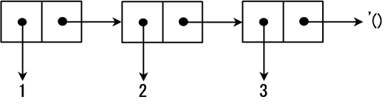

# 生成表

## 简介

作为Lisp语言大家族的一员，Scheme同样擅长于处理表。你应该理解表以及有关表的操作以掌握Scheme。表在在后面章节中的递归函数和高阶函数中扮演重要角色。

在本章中，我会讲解基本的表操作，例如`cons`，`car`，`cdr`，`list`和`quote`。

## Cons单元和表

### Cons单元

首先，让我解释一下表的元素：**Cons单元（Cons cells）**。Cons单元是一个存放了两个地址的内存空间。Cons单元可用函数`cons`生成。

在前端输入`(cons 1 2)`

```scheme
(cons 1 2)
;Value 11: (1 . 2)
```

系统返回`(1 . 2)`。如图一所示，函数`cons`给两个地址分配了内存空间，并把存放指向`1`的地址放在一个空间，把存放指向`2`的地址放在另一个空间。存放指向`1`的地址的内存空间被称作`car`部分，对应的，存放指向`2`的地址的内存空间被称作`cdr`部分。`car`和`cdr`分别是**寄存器地址部分（Contents of the Address part of the Register）**和**寄存器减量部分（Contents of the Decrement part of the Register）**的简称。这些名字最初来源于Lisp首次被实现所使用的硬件环境中内存空间的名字。这些名字同时也表明Cons单元的本质就是一个内存空间。`cons`这个名字是术语**构造（construction）**的简称。


Cons单元也可以被串起来。

```scheme
(cons 3 (cons 1 2))
;Value 15: (3 1 . 2)
```

·(3 . (1 . 2))·可以更方便地表示为`(3 1 . 2)`。这种情况的内存空间如图2所示。


Cons单元可以存放不同类型的数据，也可以嵌套。

```scheme
(cons #\a (cons 3 "hello"))
;Value 17: (#\a 3 . "hello")

(cons (cons 0 1) (cons 2 3))
;Value 23: ((0 . 1) 2 . 3)
```

这是因为Scheme可以通过地址操作所有的数据。（`#\c`代表了一个字符`c`。例如，`#\a`就代表字符`a`）

### 表

表是Cons单元通过用`cdr`部分连接到下一个`Cons`单元的开头实现的。表中包含的`’()`被称作空表。就算数据仅由一个Cons单元组成，只要它的`cdr`单元是`’()`，那它就是一个表。图3展示了表`(1 2 3)`的内存结构。




事实上，表可以像下面这样递归地定义：

1. `‘()`是一个表
2. 如果`ls`是一个表且`obj`是某种类型的数据，那么`(cons obj ls)`也是一个表
正因为表是一种被递归定义的数据结构，将它用在递归的函数中显然是合理的。

## 原子

不使用Cons单元的数据结构称为**原子（atom）**。数字，字符，字符串，向量和空表`’()`都是原子。`’()`既是原子，又是表。

> 练习1
> 
> 使用`cons`来构建在前端表现为如下形式的数据结构。
> 
> 1. `("hi" . "everybody")`
> 2. `(0)`
> 3. `(1 10 . 100)`
> 4. `(1 10 100)`
> 5. `(#\I "saw" 3 "girls")`
> 6. `("Sum of" (1 2 3 4) "is" 10)`

## 引用

所有的记号都会依据Scheme的求值规则求值：所有记号都会从最内层的括号依次向外层括号求值，且最外层括号返回的值将作为S-表达式的值。一个被称为**引用（quote）**的形式可以用来阻止记号被求值。它是用来将符号或者表原封不动地传递给程序，而不是求值后变成其它的东西。

例如，`(+ 2 3)`会被求值为`5`，然而`(quote (+ 2 3))`则向程序返回`(+ 2 3)`本身。因为`quote`的使用频率很高，他被简写为`’`。

比如：

+ `’(+ 2 3)`代表列表`(+ 2 3)`本身；
+ `’+`代表符号`+`本身；

实际上，`’()`是对空表的引用，也就是说，尽管解释器返回`()`代表空表，你也应该用`’()`来表示空表。

### 特殊形式

Scheme有两种不同类型的操作符：其一是函数。函数会对所有的参数求值并返回值。另一种操作符则是特殊形式。特殊形式不会对所有的参数求值。除`quote`外，还有`lambda`、`define`、`if`、`set!`等，也是特殊形式。

## car函数和cdr函数

返回一个Cons单元的`car`部分和`cdr`部分的函数分别是`car`和`cdr`函数。如果`cdr`部分串连着Cons单元，解释器会打印出整个`cdr`部分。如果Cons单元的`cdr`部分不是`’()`，那么其值稍后亦会被展示。

```scheme
(car '(1 2 3 4))
;Value: 1

(cdr '(1 2 3 4))
;Value 18: (2 3 4)
```

> 练习2
> 
> 求值下列S-表达式。
> 
> 1. `(car '(0))`
> 2. `(cdr '(0))`
> 3. `(car '((1 2 3) (4 5 6)))`
> 4. `(cdr '(1 2 3 . 4))`
> 5. `(cdr (cons 3 (cons 2 (cons 1 '()))))`

## list函数

`list`函数使得我们可以构建包含数个元素的表。函数`list`有任意个数的参数，且返回由这些参数构成的表。

```scheme
(list)
;Value: ()

(list 1)
;Value 24: (1)

(list '(1 2) '(3 4))
;Value 25: ((1 2) (3 4))

(list 0)
;Value 26: (0)

(list 1 2)
;Value 27: (1 2)
```

## 小结

本章讲解了表和表的基本操作。我担心前三章有些无趣。我希望下一章能有趣点，它主要讲述了如何编写函数。我也会讲解如何用编辑器来编辑代码，如何将代码加载到解释器中，以及如何定义函数。

## 习题解答

### 答案1

```scheme
;1
(cons "hi" "everybody")
;Value 32: ("hi" . "everybody")

;2
(cons 0 '())
;Value 33: (0)

;3
(cons 1 (cons 10 100))
;Value 34: (1 10 . 100)

;4
(cons 1 (cons 10 (cons 100 '())))
;Value 35: (1 10 100)

;5
(cons #\I (cons "saw" (cons 3 (cons "girls" '()))))
;Value 36: (#\I "saw" 3 "girls")

;6
(cons "Sum of" (cons (cons 1 (cons 2 (cons 3 (cons 4 '())))) (cons "is" (cons 10 '()))))
;Value 37: ("Sum of" (1 2 3 4) "is" 10)
```

### 答案2

```scheme
;1
(car '(0))
;Value: 0

;2
(cdr '(0))
;Value: ()

;3
(car '((1 2 3) (4 5 6)))
;Value 28: (1 2 3)

;4
(cdr '(1 2 3 . 4))
;Value 29: (2 3 . 4)

;5
(cdr (cons 3 (cons 2 (cons 1 '()))))
;Value 31: (2 1)
```
